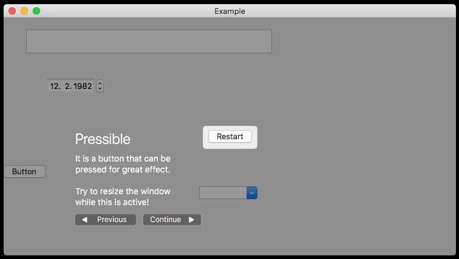

# AppGuideOverlay


[](https://github.com/Carthage/Carthage)

macOS user interface guide to display an overlay with descriptions of NSViews in your app.

## Usage

### Example

Have a look at the example app that is part of this repository. The basic setup looks like this:

```swift
// Given access to interesting view components ...
let window: NSWindow = ...
let textField: NSTextField = ...
let button: NSButton = ...

// ... and an AppGuide with steps attached to them ...
let appGuide = AppGuide(steps: [
    AppGuide.Step(title: "A Text Field",
          detail: "Use this to type something.",
          position: .below,
          cutoutView: textField),
    AppGuide.Step(title: "A Button",
          detail: "Press this to make something happen.",
          position: .right,
          cutoutView: button)
    ])

// ... keep the AppGuideOverlay around and start it:
let appGuideOverlay = AppGuideOverlay(
    appGuide: appGuide,
    appGuideSuperview: window.contentView!)
appGuideOverlay.start()
```

### Types of Interest

- `AppGuide` is the model. It contains an array of `AppGuide.Step`s that represents the steps in your guide.
- `AppGuideOverlay` is a convenient service object to set up the app guide and control it. (You don't have to use it and can use `AppGuidePresenter` and a `HandlesOverlayEvents` conforming delegate. But `AppGuideOverlay` really is the most useful façade to get started.)
- `AppGuideOverlayDelegate` is used to react to progress and completion events.

## Features

- **Uses Auto Layout** to position the `AppGuide.Step` contents next to the view the steps explain. This ensures the window size fits the labels at all times. It also ensures the step's description is displayed correctly when the window is resized. 
    <div align="center">
    
    </div>
- **Tasteful** pulsation of the cutout frame's size in the overlay. This also indicates that the app doesn't just hang.
    <div align="center">
    
    </div>
- **Good citizen:** No custom `NSRunLoop` or anything. It's just a view on top of other views that captures the first responder status and doesn't give it back to underlying controls. This means you can remote-control your user interface to change display content and animate as usual while the overlay is visible.

## Code License

Copyright (c) 2018 Christian Tietze. Distributed under the MIT License.

- Uses [LoopingAnimation](https://github.com/CleanCocoa/LoopingAnimation) code directly, also distributed under the MIT License.
